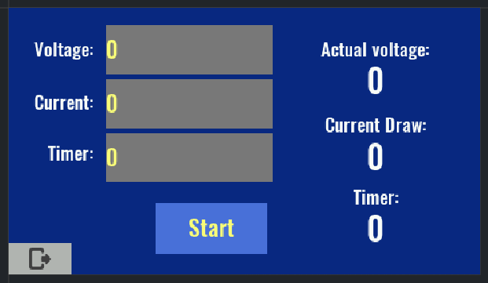

# EEZ Bench Box 3 Current/Voltage GUI
A simple script for the EEZ Bench Box 3 power supply to allow for ease of use in changing the maximum current and voltage output. Also contains an optional timer that counts down while current is being drawn, turning off output when it expires. Written using [EEZ Studio](https://github.com/eez-open/studio).

note: will look different on actual hardware due to how preset styles differ between EEZ Studio and the power supply's firmware.